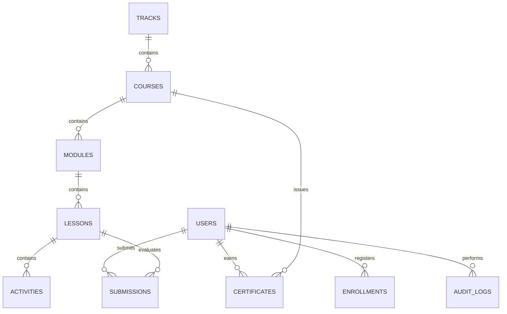

# QbitX Database Schema & Data Models (RC-1)

## 1. Entity-Relationship (ER) Diagram

---

## 2. Table Schema Definitions

### A. `users` Table
Stores authentication accounts, role permissions, and academic profiles.
- `id` (UUID, Primary Key)
- `email` (VARCHAR, Unique, Not Null)
- `name` (VARCHAR, Not Null)
- `role` (ENUM: `'student'`, `'mentor'`, `'admin'`, `'super_admin'`)
- `organization` (VARCHAR)
- `created_at` (TIMESTAMP)

### B. `courses` Table
Stores learning courses within the hierarchy (`Track → Course → Module → Lesson → Activity`).
- `id` (VARCHAR, Primary Key)
- `title` (VARCHAR, Not Null)
- `description` (TEXT)
- `category` (VARCHAR)
- `difficulty` (ENUM: `'beginner'`, `'intermediate'`, `'advanced'`)
- `version` (VARCHAR)
- `status` (ENUM: `'draft'`, `'published'`, `'archived'`)

### C. `audit_logs` Table
Captures administrative, mentor, and student actions for audit compliance.
- `id` (VARCHAR, Primary Key)
- `actor_id` (VARCHAR, Foreign Key -> `users.id`)
- `actor_name` (VARCHAR)
- `actor_role` (VARCHAR)
- `action_type` (VARCHAR)
- `target_id` (VARCHAR)
- `details` (TEXT)
- `timestamp` (TIMESTAMP)
