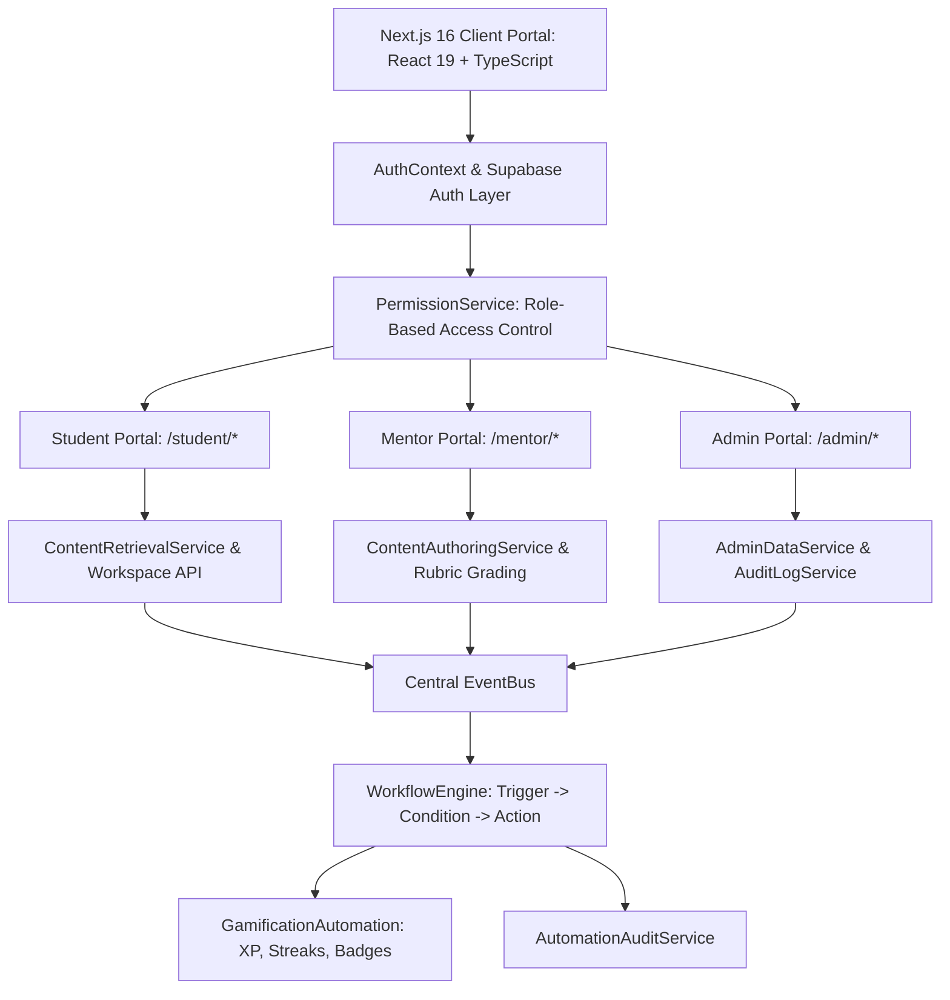
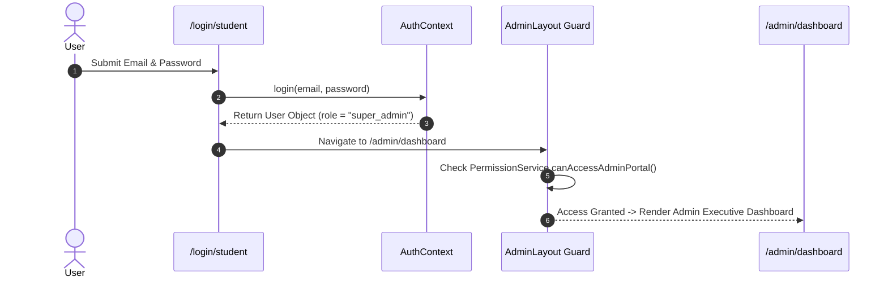
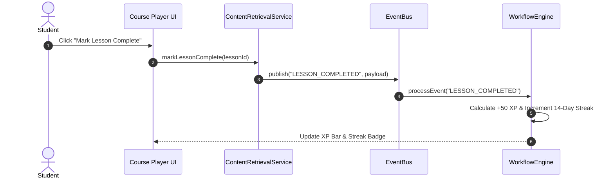
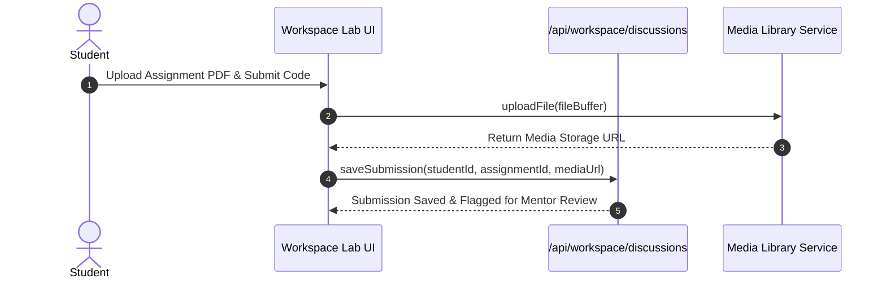
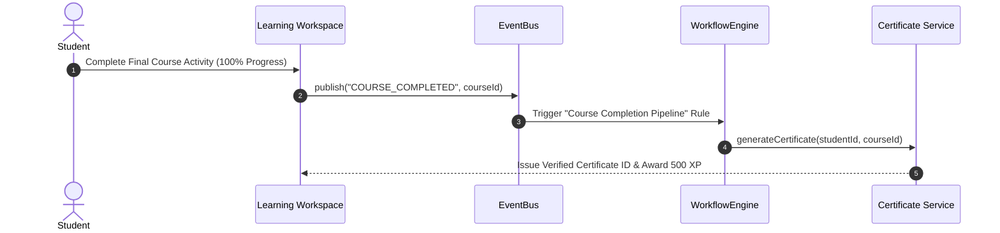
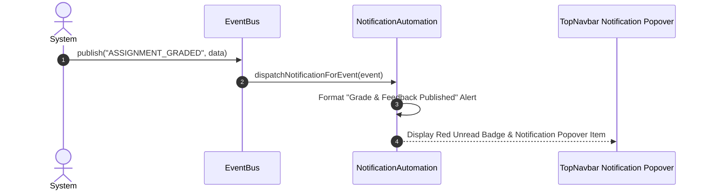
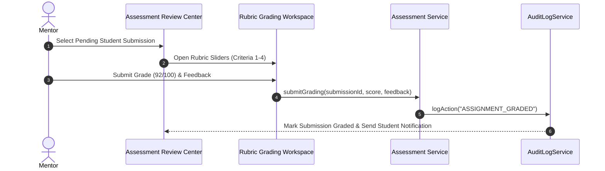
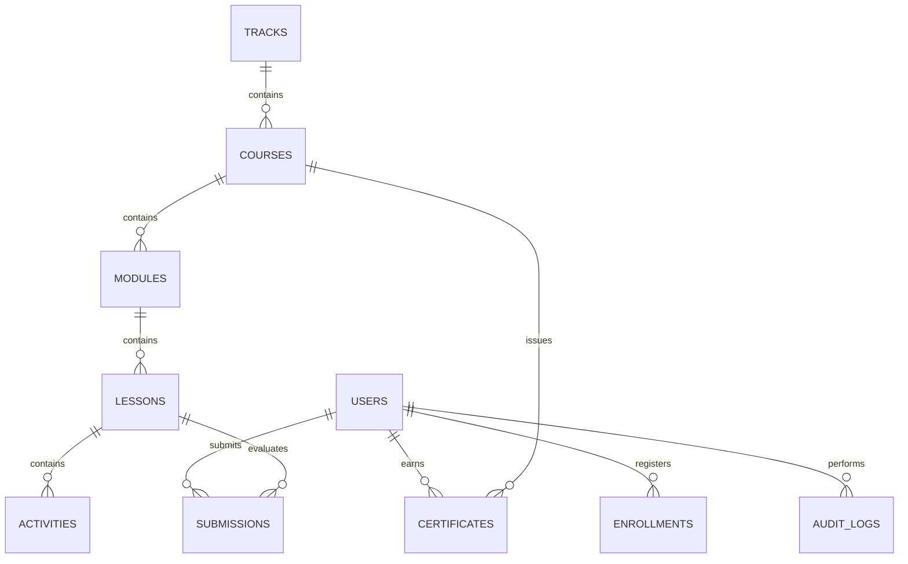

# QbitX Unified Master Technical Documentation & Enterprise Specification (Release Candidate RC-1)

---

## Table of Contents
1. [Executive Overview & Quick Setup](#1-executive-overview--quick-setup)
2. [Architecture Decision Records (ADRs)](#2-architecture-decision-records-adrs)
3. [System Architecture & 6 Sequence Diagrams](#3-system-architecture--6-sequence-diagrams)
4. [Database Schema, ER Diagram & Migration Strategy](#4-database-schema-er-diagram--migration-strategy)
5. [API Endpoint Catalog & Versioning Roadmap](#5-api-endpoint-catalog--versioning-roadmap)
6. [UI Component Specifications & Design System](#6-ui-component-specifications--design-system)
7. [Role-Based Access Control (RBAC) & Feature Matrix](#7-role-based-access-control-rbac--feature-matrix)
8. [Security Architecture & Audit Compliance](#8-security-architecture--audit-compliance)
9. [Performance Optimization Guide](#9-performance-optimization-guide)
10. [Production Deployment Guide](#10-production-deployment-guide)
11. [Project Directory Structure & Changelog](#11-project-directory-structure--changelog)
12. [Testing Report & Product Engineering Roadmap](#12-testing-report--product-engineering-roadmap)

---

## 1. Executive Overview & Quick Setup

QbitX is an investor-grade, production-ready educational platform designed to empower students, mentors, and administrators through unified content architecture, AI mentorship, notion-style course builder studios, automated workflow engines, and career portfolio hubs.

### Tech Stack Quick Reference
- **Framework**: Next.js 16 (App Router, Turbopack)
- **Frontend Core**: React 19 + TypeScript
- **Styling**: Tailwind CSS v4 + Vanilla CSS + Glassmorphism aesthetic
- **Authentication**: Supabase Auth + Typed Role Context
- **Database**: TiDB / Supabase PostgreSQL
- **Automation**: Central EventBus + Trigger-Condition-Action WorkflowEngine

### Quick Local Setup
```bash
# 1. Clone & Install
git clone https://github.com/labib-0/QbitX.git
cd QbitX
npm install

# 2. Configure .env.local
NEXT_PUBLIC_SUPABASE_URL=https://your-supabase-project.supabase.co
NEXT_PUBLIC_SUPABASE_ANON_KEY=your-supabase-anon-key
NEXT_PUBLIC_APP_URL=http://localhost:3000

# 3. Run Local Dev Server
npm run dev

# 4. Production Build Verification
npm run build
```

### Verified Demo Accounts
- **Student Role**: `student@qbitx.com` / Password: `demo-password`
- **Mentor Role**: `mentor@qbitx.com` / Password: `demo-password`
- **Super Admin Role**: `admin@qbitx.com` / Password: `demo-password`

---

## 2. Architecture Decision Records (ADRs)

### ADR-001: Next.js 16 (App Router) & React 19 Selection
- **Problem**: Need dynamic file routing, Server Components, Turbopack, and serverless API endpoints.
- **Decision**: Adopt Next.js 16 (App Router) + React 19 + TypeScript.
- **Consequence**: Fast page load times, automatic code splitting, zero-config deployment on Vercel.

### ADR-002: Supabase Auth & PostgreSQL Data Layer
- **Problem**: Need built-in auth, JWT session handling, SQL relational data queries, and typed client SDKs.
- **Decision**: Adopt Supabase Auth & Relational Database Layer.
- **Consequence**: Out-of-the-box user authentication and structured queries for course hierarchies.

### ADR-003: Centralized RBAC Permission Architecture
- **Problem**: Access control rules across 5 roles must be enforced centrally to prevent unauthorized access.
- **Decision**: Adopt `PermissionService.ts` and layout guards (`AdminLayout.tsx`, `MentorLayout.tsx`).
- **Consequence**: Non-admin/mentor users are automatically redirected before rendering protected routes.

### ADR-004: Central Event-Driven Automation Engine
- **Problem**: Side effects (certificates, XP, streaks, digests) were tightly coupled to UI action handlers.
- **Decision**: Adopt decoupled `EventBus` + `WorkflowEngine` + `QueueManager` abstraction.
- **Consequence**: Modules publish events asynchronously; ready for drop-in Redis / BullMQ integration.

### ADR-005: Interactive Demo AI Engine & Extension Hooks
- **Problem**: Demonstrations require realistic AI chat streaming without external LLM API key dependencies.
- **Decision**: Adopt `IAIProvider` factory pattern with `DemoAIProvider` and extension hooks.
- **Consequence**: Zero API key dependency for presentations; production LLM adapters can be swapped seamlessly.

---

## 3. System Architecture & 6 Sequence Diagrams

### High-Level System Architecture


### Sequence Diagram 1: Login & Role Guard Flow


### Sequence Diagram 2: Course Enrollment & Progress Flow


### Sequence Diagram 3: Assignment Submission & Storage Flow


### Sequence Diagram 4: Certificate Generation Pipeline


### Sequence Diagram 5: Notification Event Dispatch Pipeline


### Sequence Diagram 6: Mentor Review & Rubric Grading Flow


---

## 4. Database Schema, ER Diagram & Migration Strategy



### Database Migration & Rollback Strategy
- **Migration Location**: `supabase/migrations/`
- **Apply Migrations**: `npx supabase migration up`
- **Rollback Strategy**: Every migration script includes a down migration script (`DROP TABLE IF EXISTS`). Rollback via `npx supabase db reset`.

---

## 5. API Endpoint Catalog & Versioning Roadmap

### API Versioning Roadmap (`/api/v1/*`)
To ensure future backwards compatibility, the API architecture is ready for version routing:
- `/api/v1/student/*`: Student progress, enrollment, and workspace APIs.
- `/api/v1/mentor/*`: Course builder, rubric grading, and early intervention APIs.
- `/api/v1/admin/*`: Platform user management, organization, and health APIs.

### Endpoint Specifications
- `GET /api/content/courses`: Retrieve courses list.
- `POST /api/content/builder`: Author, update, or publish course content.
- `POST /api/ai/chat`: Stream AI Mentor chat response with simulated multi-stage thinking.
- `POST /api/automation/events`: Publish platform events to Central EventBus.
- `GET / POST /api/automation/jobs`: Fetch scheduled cron job statuses or trigger manual execution.

---

## 6. UI Component Specifications & Design System

### Design System Visual Tokens
- **Background**: `bg-background` (`slate-950` dark, `slate-50` light).
- **Cards & Containers**: `bg-card` (`slate-900/80` dark, `white` light) with `backdrop-blur-md` and `border border-border`.
- **Student Accents**: `sky-500` / `cyan-500` (`#0ea5e9`).
- **Mentor Accents**: `purple-600` / `indigo-600` (`#9333ea`).
- **Admin Accents**: `amber-500` / `orange-500` (`#f59e0b`).
- **Border Radius**: Cards (`rounded-3xl`), Buttons (`rounded-2xl`), Pills (`rounded-full`).

---

## 7. Role-Based Access Control (RBAC) & Feature Matrix

| Platform Feature | Student (`student`) | Mentor (`mentor`) | Admin (`super_admin`) |
| :--- | :---: | :---: | :---: |
| **View Courses & Lessons** | ✅ | ✅ | ✅ |
| **Interactive Code Editor Playground** | ✅ | ✅ | ✅ |
| **24/7 AI Code Mentor Chat** | ✅ | ✅ | ✅ |
| **Submit Assignments & Coding Labs** | ✅ | ❌ | ❌ |
| **View Student Digital Portfolio** | ✅ | ✅ | ✅ |
| **Export ATS Resume PDF** | ✅ | ❌ | ❌ |
| **Author & Edit Courses in Studio** | ❌ | ✅ | ✅ |
| **Publish Courses to Students** | ❌ | ✅ | ✅ |
| **Grade Assignments with Rubrics** | ❌ | ✅ | ✅ |
| **Early Student Risk Intervention** | ❌ | ✅ | ✅ |
| **Approve Senior Mentor Applications** | ❌ | ❌ | ✅ |
| **Manage Platform User Accounts** | ❌ | ❌ | ✅ |
| **Manage Multi-Tenant Organizations** | ❌ | ❌ | ✅ |
| **Configure System Feature Flags** | ❌ | ❌ | ✅ |
| **Inspect System Audit Logs Stream** | ❌ | ❌ | ✅ |

---

## 8. Security Architecture & Audit Compliance

- **Authentication**: Supabase Auth issued JWT bearer tokens.
- **XSS Prevention**: React 19 JSX auto-escapes string content. Code output sanitized via DOMPurify.
- **CSRF Protection**: SameSite cookie policies enforced on session cookies.
- **Audit Logging**: `AuditLogService` captures all sensitive actions (`USER_SUSPENDED`, `MENTOR_APPROVED`, `ASSIGNMENT_GRADED`, `COURSE_PUBLISHED`).

---

## 9. Performance Optimization Guide

- **Turbopack Bundler**: Fast incremental compilation.
- **Dynamic Imports**: Modals (`GlobalOmniboxSearch`, `GuidedOnboardingTour`) lazily loaded.
- **Image Optimization**: Next.js `<Image>` auto-converts to WebP/AVIF formats.

---

## 10. Production Deployment Guide

1. Push code to GitHub: `git push origin main`
2. Connect repository in Vercel Dashboard.
3. Configure Environment Variables (`NEXT_PUBLIC_SUPABASE_URL`, `NEXT_PUBLIC_SUPABASE_ANON_KEY`).
4. Build Command: `next build`. Output Directory: `.next`.

---

## 11. Project Directory Structure & Changelog

```
QbitX/
├── docs/                        # Complete technical documentation suite
│   ├── adr/                     # Architecture Decision Records (ADR-001 to ADR-005)
│   ├── database/                # Database migrations, seed data, and backup guides
│   ├── QBITX_UNIFIED_DOCUMENTATION.md # Unified Master Technical Document
│   ├── README.md                # Documentation Hub Index
│   ├── SYSTEM_ARCHITECTURE.md   # Architecture Specs
│   ├── DATABASE_SCHEMA.md       # Schemas & ER Diagram
│   ├── API_DOCUMENTATION.md     # API Endpoint Catalog
│   ├── COMPONENT_GUIDE.md       # UI Component Specs
│   ├── RBAC.md                  # Role Matrix & Guards
│   ├── SECURITY.md              # Security Policy
│   ├── PERFORMANCE.md           # Performance Optimization Guide
│   ├── DESIGN_SYSTEM.md         # Visual Tokens & Glassmorphism
│   ├── FEATURE_MATRIX.md        # Role Feature Matrix
│   ├── DEPLOYMENT_GUIDE.md      # Vercel Deployment Guide
│   ├── CONTRIBUTING.md          # Coding Standards
│   ├── PROJECT_STRUCTURE.md     # Directory Tree Mapping
│   ├── CHANGELOG.md             # Development Phase Log
│   ├── TESTING.md               # Test Suite & Verification Report
│   └── ROADMAP.md               # Completed vs. Future Roadmap
```

---

## 12. Testing Report & Product Engineering Roadmap

- **Build Status**: 100% Success across **64/64 routes**.
- **TypeScript Errors**: 0 Errors.
- **Release Candidate Status**: **RC-1 Ready for Production & Capstone Demonstration**.
