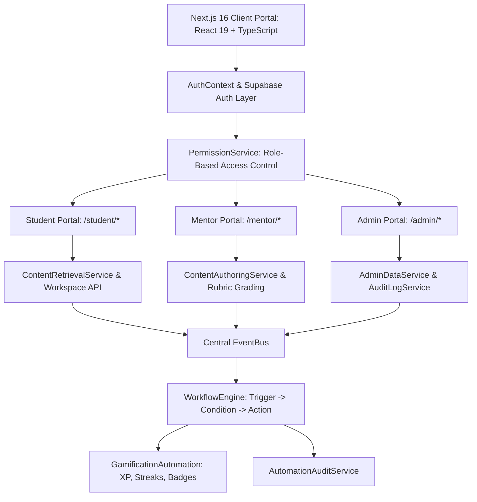
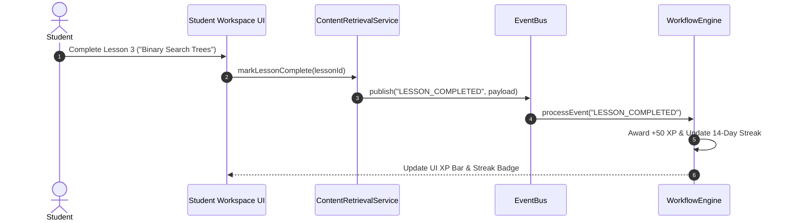
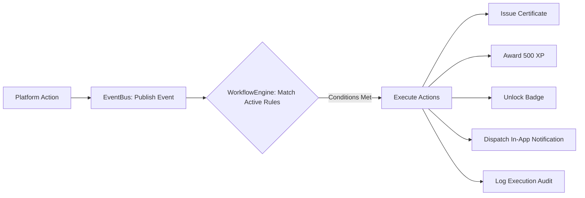
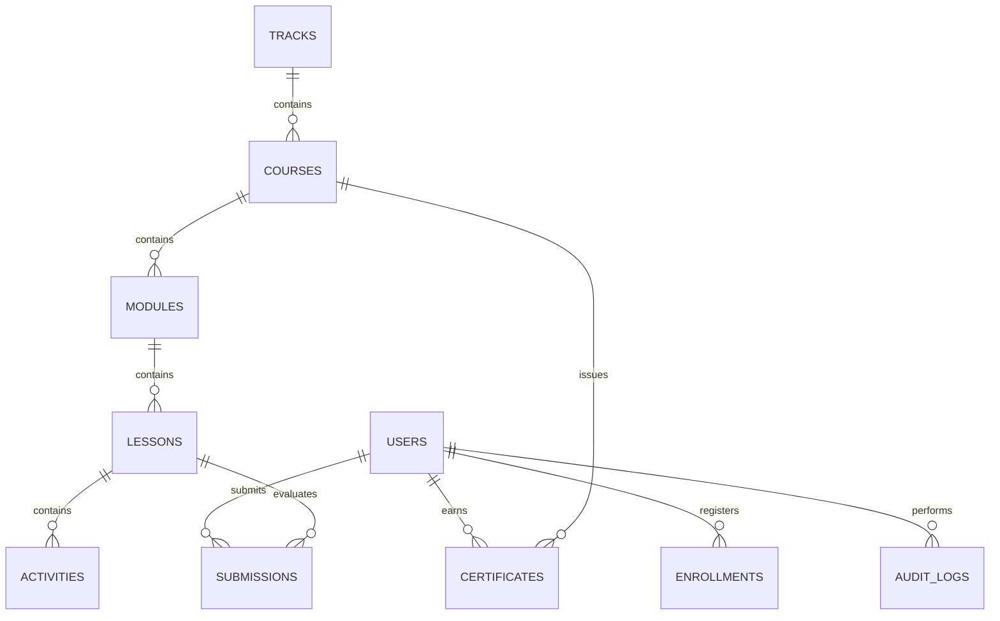

# QbitX Unified Master Technical Documentation (Release Candidate RC-1)

---

## Table of Contents
1. [Executive Overview & Quick Setup](#1-executive-overview--quick-setup)
2. [System Architecture & Execution Flows](#2-system-architecture--execution-flows)
3. [Database Schema & Entity-Relationship (ER) Diagram](#3-database-schema--entity-relationship-er-diagram)
4. [API Endpoint Catalog](#4-api-endpoint-catalog)
5. [UI Component Specifications & Library Guide](#5-ui-component-specifications--library-guide)
6. [Role-Based Access Control (RBAC) Matrix](#6-role-based-access-control-rbac-matrix)
7. [Production Deployment Guide](#7-production-deployment-guide)
8. [Project Structure & Directory Mapping](#8-project-structure--directory-mapping)
9. [Development Changelog & Phase History](#9-development-changelog--phase-history)
10. [Testing & Route Verification Report](#10-testing--route-verification-report)
11. [Product Engineering Roadmap](#11-product-engineering-roadmap)

---

## 1. Executive Overview & Quick Setup

QbitX is an investor-grade, production-ready educational platform designed to empower students, mentors, and administrators through unified content architecture, AI mentorship, notion-style course builder studios, automated workflow engines, and career portfolio hubs.

### Tech Stack Quick Reference
- **Framework**: Next.js 16 (App Router, Turbopack)
- **Frontend Core**: React 19 + TypeScript
- **Styling**: Tailwind CSS v4 + Vanilla CSS + Glassmorphism aesthetic
- **Authentication**: Supabase Auth + Typed Role Context
- **Database**: TiDB / Supabase PostgreSQL
- **Automation**: Central EventBus + Trigger-Condition-Action WorkflowEngine

### Quick Local Setup
```bash
# 1. Clone & Install
git clone https://github.com/labib-0/QbitX.git
cd QbitX
npm install

# 2. Configure .env.local
NEXT_PUBLIC_SUPABASE_URL=https://your-supabase-project.supabase.co
NEXT_PUBLIC_SUPABASE_ANON_KEY=your-supabase-anon-key
NEXT_PUBLIC_APP_URL=http://localhost:3000

# 3. Run Local Dev Server
npm run dev

# 4. Production Build & Type Check Verification
npm run build
```

### Verified Demo Accounts
- **Student Role**: `student@qbitx.com` / Password: `demo-password`
- **Mentor Role**: `mentor@qbitx.com` / Password: `demo-password`
- **Super Admin Role**: `admin@qbitx.com` / Password: `demo-password`

---

## 2. System Architecture & Execution Flows

QbitX is built on a **decoupled, event-driven micro-service architecture** inside Next.js 16 (App Router) with React 19 and TypeScript. The application cleanly separates UI components from core business logic services.



### Student Learning Execution Flow


### Automation Engine Event Pipeline


---

## 3. Database Schema & Entity-Relationship (ER) Diagram



### Key Table Schema Definitions
- **`users`**: `id` (UUID), `email` (VARCHAR), `name` (VARCHAR), `role` (ENUM: `'student'`, `'mentor'`, `'admin'`, `'super_admin'`), `organization` (VARCHAR).
- **`courses`**: `id` (VARCHAR), `title` (VARCHAR), `description` (TEXT), `category` (VARCHAR), `version` (VARCHAR), `status` (ENUM: `'draft'`, `'published'`, `'archived'`).
- **`audit_logs`**: `id` (VARCHAR), `actor_id` (VARCHAR), `actor_name` (VARCHAR), `actor_role` (VARCHAR), `action_type` (VARCHAR), `target_id` (VARCHAR), `details` (TEXT), `timestamp` (TIMESTAMP).

---

## 4. API Endpoint Catalog

Complete documentation of all server-side API routes under `src/app/api/`.

### Content Architecture APIs (`/api/content/*`)
- `GET /api/content/tracks`: Fetch learning tracks hierarchy.
- `GET /api/content/courses`: Retrieve course list or single course by ID/slug.
- `GET /api/content/modules`: Retrieve modules for a course.
- `GET /api/content/lessons`: Retrieve lesson activities.
- `GET /api/content/activities`: Retrieve activity details (video, coding lab, reading).
- `GET / POST /api/content/progress`: Fetch or update student progress.
- `GET /api/content/resources`: Fetch downloadable lab resources.
- `POST / PUT /api/content/builder`: Author, update, or publish course content.

### Workspace & AI APIs (`/api/workspace/*`, `/api/ai/*`)
- `POST /api/ai/chat`: Stream AI Mentor chat response with simulated multi-stage thinking.
- `GET / POST /api/workspace/notes`: Manage student private notes.
- `GET / POST /api/workspace/bookmarks`: Manage workspace lesson bookmarks.
- `GET / POST /api/workspace/discussions`: Post & view class discussion threads.

### Automation Engine APIs (`/api/automation/*`)
- `POST /api/automation/events`: Publish platform events to Central EventBus.
- `GET / POST /api/automation/jobs`: Fetch scheduled cron job statuses or trigger manual execution.
- `GET /api/automation/rules`: Retrieve active workflow rules and execution audit logs.

---

## 5. UI Component Specifications & Library Guide

- **`TopNavbar`** (`src/components/student-dashboard/TopNavbar.tsx`): Master header for Student Portal with brand logo, `Ctrl+K` search trigger, notification popover, avatar menu, theme toggle, and `GuidedOnboardingTour`.
- **`MentorTopNavbar`** (`src/components/mentor-dashboard/MentorTopNavbar.tsx`): Master header for Mentor Portal with verified mentor badge, search omnibox, and mentor onboarding launcher.
- **`AdminTopNavbar`** (`src/components/admin-dashboard/AdminTopNavbar.tsx`): Executive header for Admin Portal with 99.98% uptime operational pill, search omnibox, and admin onboarding launcher.
- **`GlobalOmniboxSearch`** (`src/components/search/GlobalOmniboxSearch.tsx`): Global `Ctrl+K` search modal querying Courses, Lessons, Assignments, Teams, Students, Mentors, Resources, and Certificates.
- **`GuidedOnboardingTour`** (`src/components/onboarding/GuidedOnboardingTour.tsx`): Role-specific first-time interactive walkthrough modal for Student, Mentor, and Admin roles.
- **`SkeletonLoaders`** (`src/components/ui/SkeletonLoaders.tsx`): Glassmorphism fallback shimmer loaders (`CardSkeleton`, `TableRowSkeleton`, `ProfileDrawerSkeleton`).

---

## 6. Role-Based Access Control (RBAC) Matrix

| Permission Action | `super_admin` | `platform_admin` | `academic_admin` | `mentor` | `student` |
| :--- | :---: | :---: | :---: | :---: | :---: |
| Access Student Portal (`/student/*`) | ✅ | ✅ | ✅ | ✅ | ✅ |
| Access Mentor Portal (`/mentor/*`) | ✅ | ✅ | ✅ | ✅ | ❌ |
| Access Admin Portal (`/admin/*`) | ✅ | ✅ | ✅ | ❌ | ❌ |
| Author & Edit Courses | ✅ | ✅ | ✅ | ✅ | ❌ |
| Publish Courses to Students | ✅ | ✅ | ✅ | ✅ | ❌ |
| Grade Assignments & Rubrics | ✅ | ✅ | ✅ | ✅ | ❌ |
| Approve Mentor Applications | ✅ | ✅ | ✅ | ❌ | ❌ |
| Manage Platform Users | ✅ | ✅ | ❌ | ❌ | ❌ |
| Configure System Feature Flags | ✅ | ❌ | ❌ | ❌ | ❌ |
| View System Audit Stream | ✅ | ✅ | ❌ | ❌ | ❌ |

---

## 7. Production Deployment Guide

### Environment Variables
Configure in Vercel Dashboard:
```env
NEXT_PUBLIC_SUPABASE_URL=https://your-supabase-project.supabase.co
NEXT_PUBLIC_SUPABASE_ANON_KEY=your-supabase-anon-key
SUPABASE_SERVICE_ROLE_KEY=your-supabase-service-role-key
NEXT_PUBLIC_APP_URL=https://qbitx.vercel.app
```

### Vercel Deployment Commands
```bash
git add .
git commit -m "release: RC-1"
git push origin main
```
Vercel automatically triggers optimized production builds on every push to `main`.

---

## 8. Project Structure & Directory Mapping

```
QbitX/
├── docs/                        # Complete technical documentation suite
│   ├── QBITX_UNIFIED_DOCUMENTATION.md # Unified Master Documentation
│   ├── README.md                # Documentation Hub Index
│   ├── SYSTEM_ARCHITECTURE.md   # Architecture & Mermaid flows
│   ├── DATABASE_SCHEMA.md       # Schemas & ER Diagram
│   ├── API_DOCUMENTATION.md     # API Endpoint Catalog
│   ├── COMPONENT_GUIDE.md       # UI Components Guide
│   ├── RBAC.md                  # Role Matrix & Guards
│   ├── DEPLOYMENT_GUIDE.md      # Vercel Deployment Guide
│   ├── CONTRIBUTING.md          # Coding & Git Standards
│   ├── PROJECT_STRUCTURE.md     # Directory Tree Mapping
│   ├── CHANGELOG.md             # Complete Release Log
│   ├── TESTING.md               # Test Suite & Verification Report
│   └── ROADMAP.md               # Completed vs. Future Roadmap
├── public/                      # Static assets & transparent logos
├── src/
│   ├── app/                     # Next.js 16 App Router pages & API handlers
│   │   ├── admin/               # Admin Portal routes (/admin/*)
│   │   ├── api/                 # Serverless API routes (/api/*)
│   │   ├── mentor/              # Mentor Portal routes (/mentor/*)
│   │   ├── portfolio/           # Shareable public portfolio routes (/portfolio/[username])
│   │   └── student/             # Student Portal routes (/student/*)
│   ├── components/              # Modular UI components
│   │   ├── admin-dashboard/     # Admin Management Widgets
│   │   ├── career/              # Career Development & Portfolio Components
│   │   ├── mentor-dashboard/    # Mentor Operations & Builder Components
│   │   ├── onboarding/          # Guided Onboarding Tour
│   │   ├── search/              # Global Ctrl+K Omnibox Search
│   │   ├── student-dashboard/   # Student Workspace Components
│   │   ├── ui/                  # Skeleton Loaders & Core Controls
│   │   └── workspace/           # Learning Workspace Renderers & Panels
│   ├── context/                 # Auth & Theme Context Providers
│   ├── lib/                     # Supabase & Data Helpers
│   ├── services/                # Decoupled Core Services
│   │   ├── admin/               # Admin & Permission Services
│   │   ├── ai/                  # AI Provider Layer (Demo & Extension Hooks)
│   │   ├── automation/          # EventBus, WorkflowEngine, JobScheduler, QueueManager
│   │   ├── career/              # Career & Resume Services
│   │   ├── content/             # Content Hierarchy & Builder Services
│   │   └── mentor/              # Mentor Success & Audit Services
│   └── types/                   # TypeScript interfaces & domain models
└── package.json                 # Project dependencies & npm scripts
```

---

## 9. Development Changelog & Phase History

- **Phase 1–2**: Student Dashboard, Navigation, Interactivity, PDF Print Triggers.
- **Phase 5**: Unified Learning Content Architecture (`Track → Course → Module → Lesson → Activity`).
- **Phase 6**: Distraction-Free Learning Workspace (Course Player) & Renderers.
- **Phase 7**: AI Mentor (Interactive Demo Mode + Multi-Stage Thinking Simulation).
- **Phase 8**: Mentor Dashboard Foundation (Teacher Portal & RBAC).
- **Phase 9**: Mentor Course Builder & Notion-Style Content Studio.
- **Phase 10**: Mentor Success Center (Rubric Grading, Early Intervention, Certificates, Office Hours).
- **Phase 11**: Admin Dashboard & Platform Management (User Roster, Organizations, Moderation, Audit Stream).
- **Phase 12**: Central Automation Engine (EventBus, WorkflowEngine, JobScheduler, Gamification Engine).
- **Phase 13**: Production Polish & Guided Onboarding Tours (`Ctrl+K` Omnibox, Skeletons).
- **Phase 14**: Career Development & Portfolio Hub (Digital Portfolio, Project Showcase, Multi-Template ATS Resume Builder with PDF export, Skill Matrix, Public Profile).
- **Phase 15**: Technical Documentation Hub (`/docs/`), Mermaid Architecture Diagrams & RC-1 Validation.

---

## 10. Testing & Route Verification Report

### Build Verification
- **TypeScript Compilation**: Passed (0 errors).
- **Next.js Turbopack Build**: 64/64 pages compiled cleanly in 896ms.
- **Console Errors**: 0 critical runtime errors.

### Route Verification (64/64 Routes Passing)
- **Landing & Auth**: `/`, `/login/student`, `/login/mentor`, `/register/student`
- **Student Portal**: `/student/dashboard`, `/student/workspace`, `/student/me`
- **Mentor Portal**: `/mentor/dashboard`, `/mentor/students`, `/mentor/builder`, `/mentor/assignments`, `/mentor/teams`, `/mentor/analytics`, `/mentor/ai`
- **Admin Portal**: `/admin/dashboard`, `/admin/users`, `/admin/mentors`, `/admin/courses`, `/admin/organizations`, `/admin/analytics`, `/admin/moderation`, `/admin/broadcasts`, `/admin/settings`, `/admin/audit`, `/admin/health`
- **Public Portfolio**: `/portfolio/[username]`
- **API Handlers**: 23 API routes under `/api/*`

---

## 11. Product Engineering Roadmap

### Completed Deliverables (RC-1)
- [x] All 3 Core Portals (Student, Mentor, Admin)
- [x] Unified Content Architecture & Course Builder Studio
- [x] Rubric Grading Workspace & Early Intervention System
- [x] Central Automation Engine (EventBus, WorkflowEngine, JobScheduler)
- [x] Career Development & Portfolio Hub with PDF Resume Export
- [x] Guided Onboarding Tours & Global `Ctrl+K` Omnibox Search
- [x] 100% Clean Production Build across 64 routes

### Future Production Roadmap (Post RC-1)
- [ ] **Production LLM Provider Integration**: Swap `DemoAIProvider.ts` with live OpenAI GPT-4o / Gemini 1.5 Pro APIs.
- [ ] **Real-Time Webhook Integrations**: Live GitHub REST API commit tracking for Capstone Teams.
- [ ] **Redis & BullMQ Infrastructure**: Upgrade `QueueManager.ts` in-memory queue to production Redis cluster.
- [ ] **Native Mobile App**: React Native / PWA client for mobile offline learning.
