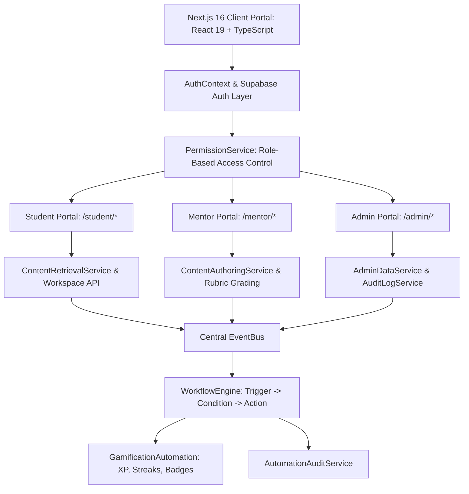
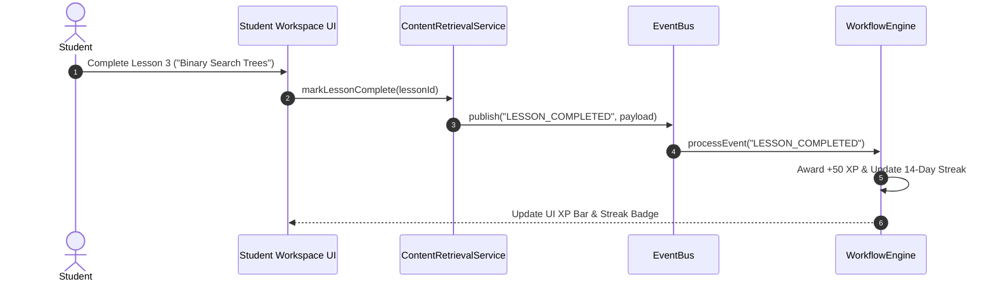
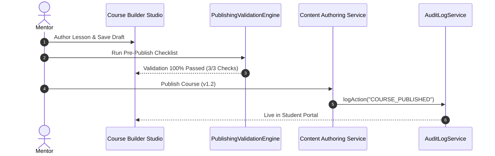
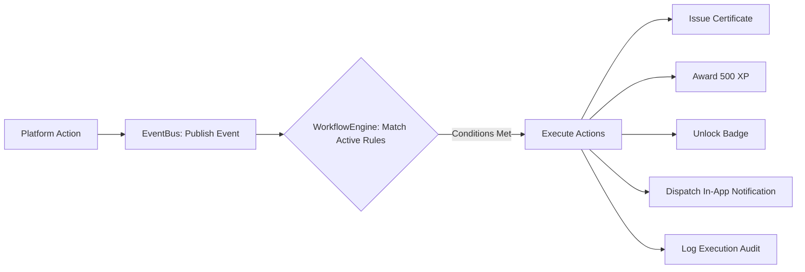

# QbitX System Architecture (Release Candidate RC-1)

## 1. High-Level Architecture Overview

QbitX is built on a **decoupled, event-driven micro-service architecture** inside Next.js 16 (App Router) with React 19 and TypeScript. The application cleanly separates UI components from core business logic services, allowing seamless integration across Student, Mentor, and Admin portals.

---

## 2. Student Portal Execution Flow

---

## 3. Mentor Course Authoring & Success Flow

---

## 4. Automation Engine & Event Pipeline

